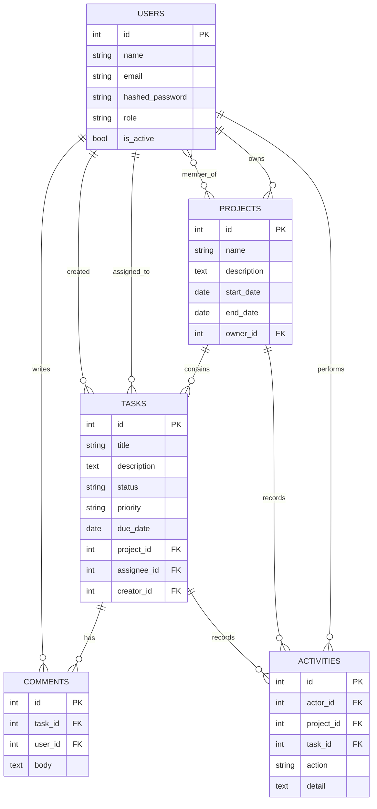

# Database relationships

```mermaid
erDiagram
  USERS ||--o{ PROJECTS : owns
  USERS }o--o{ PROJECTS : member_of
  PROJECTS ||--o{ TASKS : contains
  USERS ||--o{ TASKS : assigned_to
  USERS ||--o{ TASKS : created
  TASKS ||--o{ COMMENTS : has
  USERS ||--o{ COMMENTS : writes
  USERS ||--o{ ACTIVITIES : performs
  PROJECTS ||--o{ ACTIVITIES : records
  TASKS ||--o{ ACTIVITIES : records
  USERS { int id PK string name string email string hashed_password string role bool is_active }
  PROJECTS { int id PK string name text description date start_date date end_date int owner_id FK }
  TASKS { int id PK string title text description string status string priority date due_date int project_id FK int assignee_id FK int creator_id FK }
  COMMENTS { int id PK int task_id FK int user_id FK text body }
  ACTIVITIES { int id PK int actor_id FK int project_id FK int task_id FK string action text detail }
```
